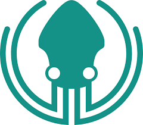

Getting started - UseR Group UL
========================================================
author: Mario van Telgen
date: March 2nd, 2018
autosize: false

Overview
========================================================
- Aim of group
- Meeting setup
- Accessing group documents
- Questionaire

Aim of UseR Group
========================================================
Through **monthly workshops/presentations** given by group members, these meetings provide an environment in which members can:
* **get started** with **or improve** their programming in R;
* **get hands-on experience** in programming in R;
* **help each other** solving problems they encounter while programming in R.

Meeting setup*
========================================================
1.	Advanced R presentation (~30mins):  
    > * <small>E.g. using R as a GIS tool, performing spatial analyses or parallel computing using R.</small>

2.	Basic R presentation (~30 mins):  
    > * <small>E.g. basics of the R-language, data exploration, using R-markdown, plotting in R, or how to use Shiny in R Studio.</small>

3.	Q&A (~30 mins):  
    > * <small>Time to ask questions and discuss problems you encounter in your own scripts and analyses.</small>

<small><small><small>*) Optionally the basic and advanced presentations could take place on separate days.</small></small></small>

Accessing group documents
========================================================
All meeting documents (presentations and R-scripts) will be publicly available in a GitHub repository

https://GitHub.com/MarioDvanTelgen/UseRGroupUL

* Prior to meetings in  
_**'~/Documents/01_Upcoming_Presentations'**_  
* After meetings (for later reference) in _**'~/Documents/00_Archive/Previous_R-code_and_Presentations'**_  

Git and GitHub - Getting started
========================================================
**What is Git?**
* Version control system to:
    + Track changes in computer files (any filetype)
    + Coordinate work on those files among multiple people
    
**What is GitHub?**
* Web-based hosting service for version control using git

 

Git and GitHub - Getting started
========================================================
1. Install Git  
    + Go to: https://git-scm.com/book/en/v2/Getting-Started-Installing-Git

2. Create a GitHub account  
    + Go to: https://GitHub.com/

3. Link R-Studio and GitHub  
    + Go to: https://www.r-bloggers.com/rstudio-and-GitHub/  
        + Skip *'Create New project...'*, continue at *'Clone an existing GitHub project...' using our GitHub repository URL: https://GitHub.com/MarioDvanTelgen/UseRGroupUL
    
Questionaire
========================================================
* Questionaire used for:
    + E-mail list
    + Member's skills and interests
    + Member's possible contributions
    + Planning

> If not already done, please fill and send the questionaire [[link]](https://github.com/MarioDvanTelgen/UseRGroupUL/raw/master/Documents/UseR%20Group%20UL%20Questionaire%20empty.xlsx) to mario.van-telgen.1@ulaval.ca

Thank you!
========================================================
Questions?

Other links
========================================================

* Git and GitHub tutorial for beginners:   https://product.hubspot.com/blog/git-and-GitHub-tutorial-for-beginners

* GitKraken  
https://www.gitkraken.com/

* Github and R-Studio  
https://support.rstudio.com/hc/en-us/articles/200532077-Version-Control-with-Git-and-SVN

 

